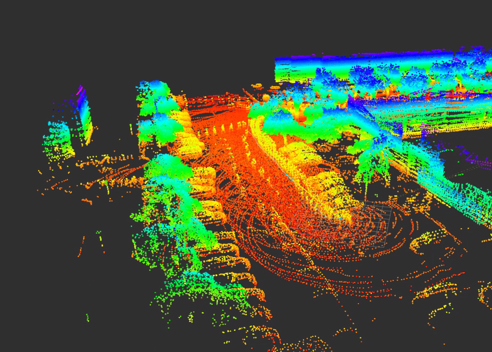
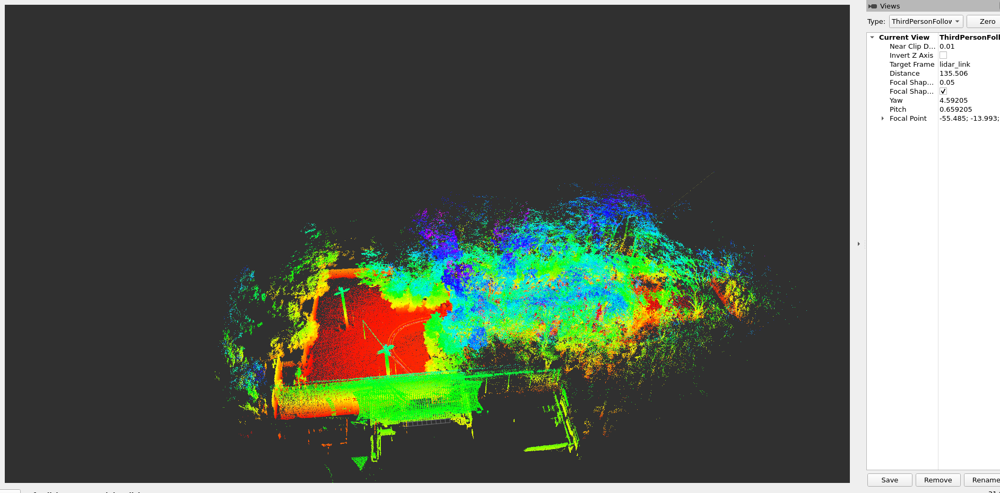

# LIO_SAM_HESAI (ROS 2)

Adapted LIO-SAM for Hesai XT16. This fork renames the package to `lio_sam_hesai` (ROS package names must be lowercase) and updates configs/launch for hesai xt16 usage.

## Features
- Hesai XT16 point cloud and timing assumptions
- Clean ROS 2 launch (`run.launch.py`)
- Same node graph as LIO-SAM (image projection, feature extraction, IMU preintegration, map optimization)
- Directly supports ROS Bag Integration
- Supports both 6-axis and 9-axis IMUs
- Using Local Geometric Consistency Filtering (KNN and Planar consistency)
- Use voxel persistence filtering and edge filtering to filter dynamic obstacles
- Use kdtree

## Requirements
- Ubuntu 22.04 + ROS 2 Humble (other ROS 2 distros may work)
- GTSAM 4.x (`libgtsam-dev` and `libgtsam-unstable-dev`)
- PCL, OpenCV (installed via ROS packages below)

Install ROS packages (replace `<ros2>` with your distro, e.g., `humble`):
```
sudo apt update
sudo apt install \
  ros-<ros2>-perception-pcl \
  ros-<ros2>-pcl-msgs \
  ros-<ros2>-vision-opencv \
  libgtsam-dev libgtsam-unstable-dev
```

## Build
```
cd ~/ros2_ws/src
# this folder should be at ~/ros2_ws/src/LIO_SAM_HESAI
cd ..
colcon build --symlink-install
source install/setup.bash
```

## Configure for Hesai XT16
Edit `config/params.yaml`:
- Set sensor to Hesai settings (rings, horizon) appropriate for XT16
- Set topics to match your Hesai driver output
- Set IMU extrinsics so IMU -> lidar follows REP-105 (x forward, y left, z up)

Default static TFs in `launch/run.launch.py` assume co-located IMU and lidar; adjust if your mounting differs.

Edit the fov of the Lidar setting. For Hesai XT16 (Default) it is -15 to 15 degree.

## Run
```
ros2 launch lio_sam_hesai run.launch.py
```

Play a bag in another terminal:
```
ros2 bag play your_data
```

## Save map service
```
ros2 service call /lio_sam/save_map lio_sam_hesai/srv/SaveMap "{resolution: 0.2, destination: /tmp/LOAM}"
```




Note: The service name `/lio_sam/save_map` follows the original namespace; the type is from this package.

## Notes
- Ensure Livox point type provides per-point time (relative within scan) and ring/channel index. Adapt `imageProjection.cpp` if your fields differ.
- DDS/QoS: tune if running over networks with Livox drivers.

## Issues
- There was a large bias when using Livox IMU. This lead to an inaccurate incremental odometry estimate.
  
## Credits
- Adaptation and maintenance: Vishnuraj A
- Based on the original LIO-SAM by Tixiao Shan and LIO_SAM_MID360 by Christoph Gruberet et al. See `LICENSE` and original repository for citations.
