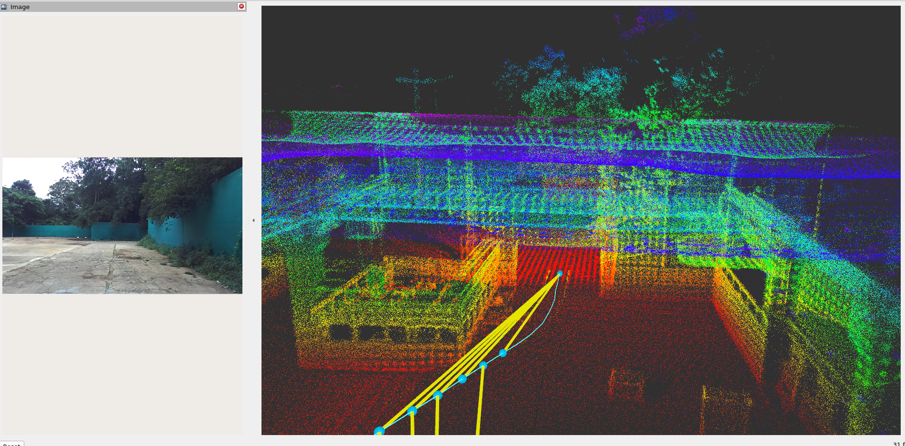
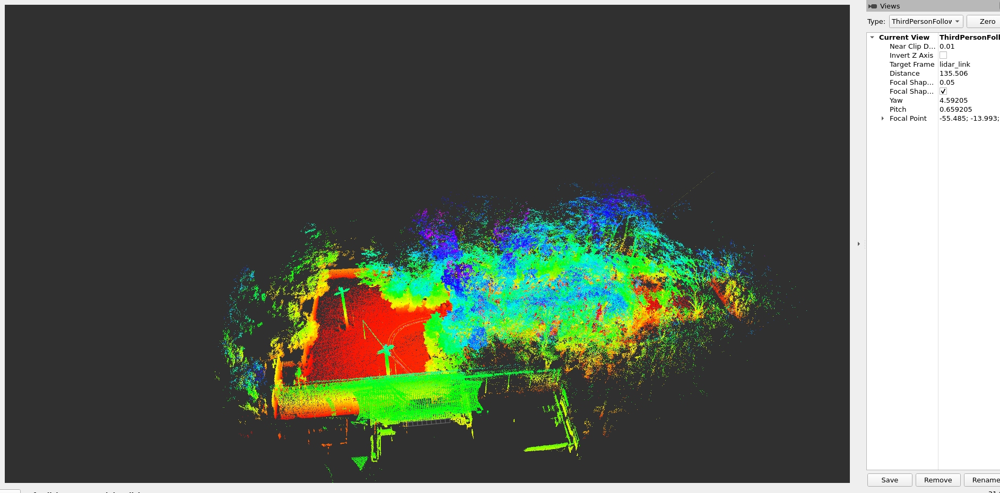
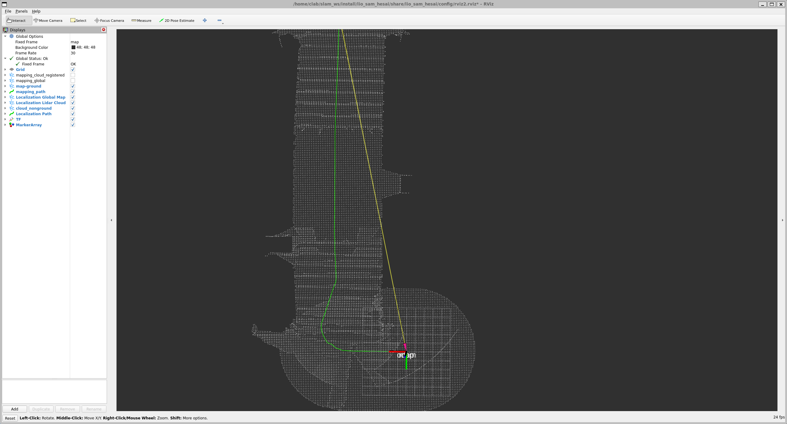
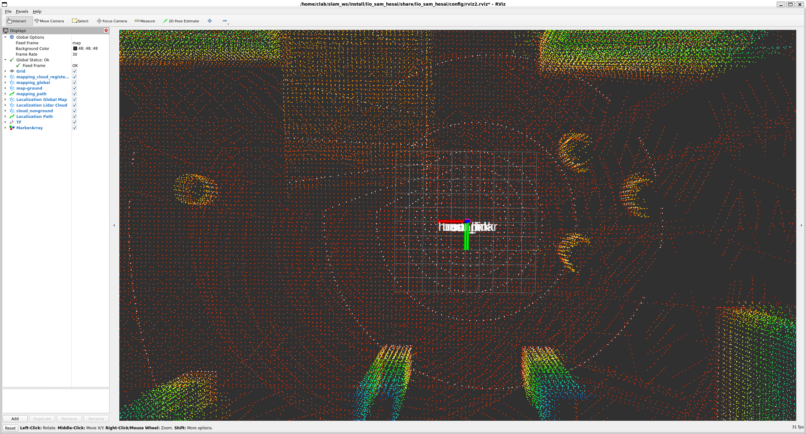
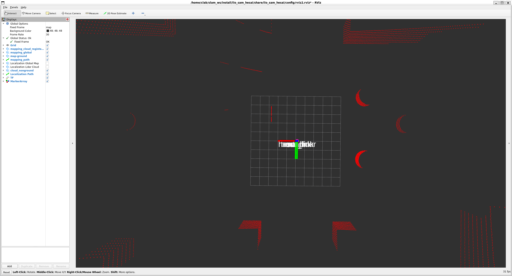

# LIO_SAM_HESAI (ROS 2)

适配Hesai XT16的LIO-SAM。这个分支将包名重命名为`lio_sam_hesai`，并针对Hesai XT16的使用场景更新了配置和launch文件。已在Jetson Orin NX上验证。

## 功能特性
- 适配Hesai XT16的点云格式与时间戳假设
- 简洁的ROS 2启动文件（`mapping.launch.py`）
- 与LIO-SAM保持相同的节点图（image projection、feature extraction、imu preintegration、map optimization）
- 同时支持6轴和9轴imu
- 使用局部几何一致性过滤（KNN和平面一致性）
- 使用体素持久性过滤和边缘过滤来过滤动态障碍物
- 使用kd-tree
- 修复TF树
- 增加重定位功能
- 增加地面点云和非地面点云输出（用于3D导航）

## 依赖要求
- Ubuntu 22.04 + ROS 2 Humble（其他ROS 2发行版理论上也可能可用）
- GTSAM 4.x（`libgtsam-dev`和`libgtsam-unstable-dev`）
- PCL、OpenCV（可通过下面的ROS软件包安装）

1. 安装ROS软件包（将`<ros2>`替换为你的发行版，例如`humble`）：
```bash
sudo apt update
sudo apt install \
  ros-<ros2>-perception-pcl \
  ros-<ros2>-pcl-msgs \
  ros-<ros2>-vision-opencv \
  libgtsam-dev libgtsam-unstable-dev
```

2. 安装glog、gflags和gtest：
```bash
sudo apt-get install libgoogle-glog-dev libgflags-dev libgtest-dev
```

3. 安装g2o：
```bash
sudo apt install libeigen3-dev libspdlog-dev libsuitesparse-dev qtdeclarative5-dev qt5-qmake libqglviewer-dev-qt5 # g2o requirements

git clone https://github.com/RainerKuemmerle/g2o.git
cd g2o
mkdir build
cd build
cmake ..
make -j
sudo make install
```

## 编译
```bash
cd ~/ros2_ws/src
cd ..
colcon build --symlink-install
source install/setup.bash
```

## 针对机械雷达的配置
编辑`config/mapping.yaml`和`config/relocalization.yaml`：
- 将传感器参数设置为适用于的你雷达的配置（ring、Horizon等）
- 将topic设置为与你的雷达驱动输出一致
- 设置IMU外参，使IMU -> lidar坐标关系符合REP-105（x向前，y向左，z向上）
- 其它参数参考配置文件注释。

`launch/mapping.launch.py`中默认的静态TF假设IMU和lidar共点安装；如果你的安装位置不同，需要自行调整。

还需要修改雷达的视场角（FOV）设置。对于Hesai XT16（默认参数），范围为-15到15度。

## 一、建图
### 1. 运行
```bash
ros2 launch lio_sam_hesai mapping.launch.py
```

在另一个终端播放bag：
```bash
ros2 bag play your_data
```

### 2. 保存地图服务
```bash
ros2 service call /lio_sam/save_map lio_sam_hesai/srv/SaveMap "{resolution: 0.2, destination: /tmp/LOAM}"
```





注意：服务名`/lio_sam/save_map`沿用了原始命名空间；但服务类型来自当前这个包。

## 二、重定位
### 1. 运行
```bash
ros2 launch lio_sam_hesai relocalization.launch.py
```

### 2. 在RViz中设置初始位置



## 三、重定位加非地面点输出
```bash
ros2 launch lio_sam_hesai localization_with_nonground.launch.py
```



## 注意
- 请确保Livox点类型包含每个点的时间信息（扫描内相对时间）以及ring/channel索引。如果字段定义不同，请修改`imageProjection.cpp`。
- DDS/QoS：如果运行Livox驱动，请根据实际情况调整相关参数。
- 地面分割只适合机械雷达。

## 致谢
- 适配与维护：LRF
- 基于Tixiao Shan的原始项目[LIO-SAM](https://github.com/TixiaoShan/LIO-SAM)以及Vishnura的[LIO_SAM_MID360](https://github.com/rajvishnu07/lio_sam_mid360)开发，引用信息请参见`LICENSE`和原始仓库。
- 本项目的重定位功能参考了[funny_lidar_slam](https://github.com/zm0612/funny_lidar_slam)。
- 感谢gpt的支持。
